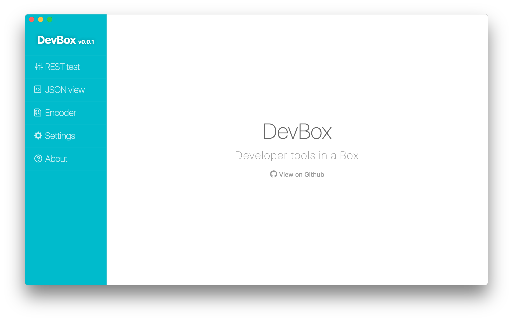

DevBox
---

An Desktop application for developers.



## Building

```sh
$ git clone https://github.com/SFantasy/devbox
$ cd devbox
$ npm install
$ npm run webpack:build
$ npm start
```

## Development

```sh
$ npm run webpack:watch
// Open another tab in your terminal
$ npm start --debug
```

## License

See [LICENSE](LICENSE) file.
